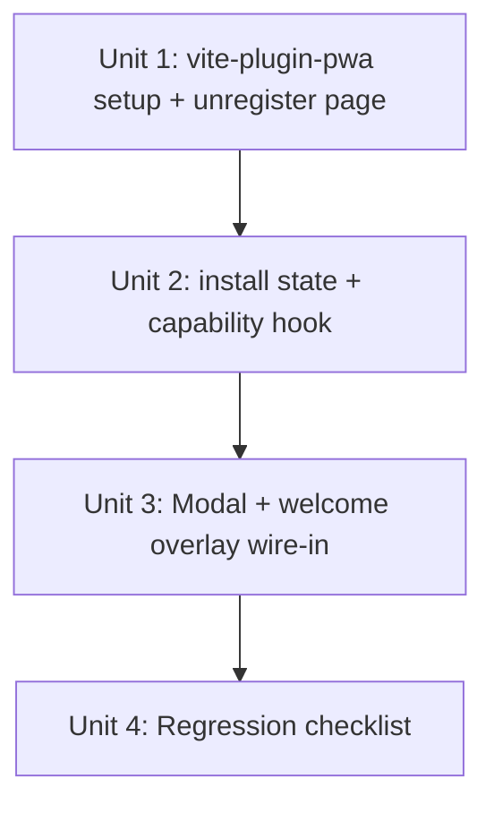

# PWA Install Invitation in Welcome Overlay

## Overview

Ajout d'une invitation discrète à installer la PWA dans le welcome overlay (écran d'accueil avant sélection de ville). Le flow se branche par capacité au runtime : prompt natif Chromium si l'événement `beforeinstallprompt` a été capturé, sinon mini-modal d'instructions adaptée au contexte (Safari iOS, in-app WebView, autres). Pour rendre `beforeinstallprompt` disponible côté Chromium, on enregistre un service worker minimal via `vite-plugin-pwa` (pré-cache de l'app shell uniquement, JSON `/data/**` jamais cachés).

## Problem Frame

Aujourd'hui aucun service worker n'est enregistré, donc Chromium ne déclenche jamais `beforeinstallprompt` ; les utilisateurs n'ont pas de point d'entrée discoverable pour installer l'app malgré un manifest valide. Les utilisateurs récurrents passent par le navigateur à chaque visite alors qu'une PWA installée donnerait un accès en un tap, plein écran (see origin: `docs/brainstorms/2026-04-30-pwa-install-invitation-requirements.md`).

## Requirements Trace

- **R1 / R1b / R2** — Service worker minimal via `vite-plugin-pwa`, configuré pour le sous-chemin GitHub Pages `/carburants-france/`, stratégie `autoUpdate` + `NetworkFirst` sur navigations HTML, JSON `/data/**` en `NetworkOnly` → couvert par Unit 1
- **R3** — Détection standalone via `display-mode` + `navigator.standalone` → couvert par Unit 2
- **R5** — Capture de `beforeinstallprompt` au plus tôt + `appinstalled` + flag localStorage cross-session → couvert par Unit 2
- **R6 / R10** — Lien discret dans le welcome overlay, mirror du style du bouton secondaire « ou tapez une ville ci-dessus », pas de bouton de fermeture → couvert par Unit 3
- **R7** — Lien masqué si standalone, flag installé, ou modal ouverte ; après `prompt() dismissed` la prochaine action passe par la modal → couvert par Units 2 et 3
- **R8** — Branchement par capacité au clic → couvert par Units 2 et 3
- **R9 / R9b** — Mini-modal d'instructions, copy adaptée au contexte ; a11y assurée par Radix Dialog avec bouton « Fermer » localisé → couvert par Unit 3
- **R11** — Réactivité de l'install state (sans rechargement) + sync cross-tab → couvert par Unit 2

## Scope Boundaries

- **Pas** de mode hors-ligne : tuiles map et JSON stations jamais précachés ni cachés runtime (NetworkOnly explicite sur `/data/**`)
- **Pas** d'analytics tiers ni instrumentation de conversion réseau. *Exception* : deux compteurs localStorage purement locaux `pwa_install_link_clicks` et `pwa_install_accepted` (incréments seulement, jamais transmis, inspectables via DevTools si support en a besoin). Coût : ~3 lignes dans `useInstallPrompt`. Bénéfice : un signal qualitatif manuel pour décider si la feature mérite d'être conservée, supprimée ou itérée six mois après merge
- **Pas** d'invitation hors du welcome overlay en v1. Aujourd'hui aucune restauration de `selectedCity` n'existe dans `App.tsx`, donc l'invite est vue à chaque visite. **Hard gate** : la PR future qui ajoute la restauration de `selectedCity` (ex. UI redesign) **doit obligatoirement** ajouter un point d'entrée secondaire (bouton « Installer » dans le footer) dans la même PR. Cette contrainte est documentée dans System-Wide Impact et doit être appliquée en code review
- **Pas** de bouton de fermeture sur l'invitation
- **Pas** de changements visuels au-delà du nouveau lien et de la mini-modal
- **Pas** de modification du manifest existant (`public/manifest.webmanifest` reste source de vérité)
- **Pas** de suppression du `<link rel="manifest">` actuel dans `index.html`
- **Pas** de polling SW au-delà du comportement par défaut de `registerType: 'autoUpdate'` (pas d'`setInterval(reg.update)` — le NetworkFirst sur navigations couvre la fraîcheur)
- **Pas** de tests unitaires automatisés : le projet n'a pas de test runner ; toutes les vérifications passent par la regression checklist manuelle de Unit 4

## Context & Research

### Relevant Code and Patterns

- `src/App.tsx:268-303` — Welcome overlay (insertion point pour le lien Installer). Le bouton secondaire « ou tapez une ville ci-dessus » à `App.tsx:292-300` est le style à mirror : `className="mt-6 flex items-center gap-1 text-xs text-gray-400 transition-colors hover:text-gray-600"`, inline SVG `h-3.5 w-3.5` avec `stroke="currentColor"`.
- `src/components/AboutModal.tsx:1-70` — Modal canonique : `<Dialog open onOpenChange={(o) => !o && onClose()}>` + `<DialogContent>` + `<DialogHeader><DialogTitle>...</DialogTitle></DialogHeader>`. Radix gère focus trap, ESC, ARIA, focus restoration. **Note importante** : `DialogContent` rend par défaut un bouton de fermeture avec `<span className="sr-only">Close</span>` (anglais). Pour la mini-modal d'install, passer `showCloseButton={false}` et rendre un bouton `<DialogClose>Fermer</DialogClose>` localisé pour respecter R9b.
- `src/components/PriceHistoryModal.tsx:1-3` — Pattern pour un titre screen-reader-only via `VisuallyHidden` de `radix-ui` (non utilisé ici — titre visible).
- `src/hooks/useStations.ts` — Pattern hook custom : named export, return objet littéral, cleanup d'useEffect.
- `src/main.tsx` (10 lignes, bare entry) — Insertion site de `registerSW()` et des listeners `beforeinstallprompt`/`appinstalled`, **avant** `createRoot().render()`.
- `src/index.css:13-32, 96-100` — `@theme` tokens, `.glass` utility (rgba(255,255,255,0.85) + backdrop-filter blur).
- `vite.config.ts:8` — `base: '/carburants-france/'` (auto-inherited by VitePWA, ne pas dupliquer).
- `index.html:5-13, 33` — Tous les meta PWA (apple-mobile-web-app-*, theme-color, manifest link) déjà en place. **Aucune modification HTML requise.**
- `public/manifest.webmanifest` — Manifest valide (`id`, `scope: '/carburants-france/'`, `start_url`, 4 icônes dont une maskable, `display: standalone`). À conserver tel quel.

### Institutional Learnings

- Aucune entrée pertinente dans `docs/solutions/`. Cette feature est un bon candidat pour une note `docs/solutions/best-practices/` post-merge (pattern PWA install + capability branching + cross-tab sync via storage event).

### External References

- vite-plugin-pwa v1.2.0 (Nov 2025), Vite 7 supporté depuis v1.0.1. Pas de peer-dep React. Source : https://github.com/vite-pwa/vite-plugin-pwa
- `manifest: false` skippe **à la fois** la génération ET l'injection du `<link rel="manifest">` → notre static link reste obligatoire dans `index.html`. Source : `src/html.ts` du plugin.
- `base` et `scope` auto-inherited de `vite.config.ts` → ne pas les passer à VitePWA.
- `registerType: 'autoUpdate'` active `clientsClaim` + `skipWaiting` automatiquement.
- Pattern NetworkFirst sur navigations : `runtimeCaching` avec `urlPattern: ({request}) => request.mode === 'navigate'`, `handler: 'NetworkFirst'`, `networkTimeoutSeconds: 3`.
- Exclusion `/data/**` : combinaison `navigateFallbackDenylist` (regex) + `runtimeCaching` `NetworkOnly` (sans ajouter `json` à `globPatterns`).
- `registerSW({ immediate: true })` : `immediate` est documenté pour la registration manuelle dans vite-plugin-pwa v1.x (force l'enregistrement dès l'import au lieu d'attendre `window.load`).
- TypeScript : `/// <reference types="vite-plugin-pwa/client" />` dans `src/vite-env.d.ts` (à créer, n'existe pas aujourd'hui).
- GitHub Pages cache headers : à **vérifier** avant merge (curl -I sur un asset existant et sur `/sw.js` après premier deploy preview). Hypothèse de travail : `max-age=600` global. Si la TTL réelle est plus longue, le `unregister-sw.html` (livré avec Unit 1, voir Risks) reste atteignable car servi en navigation.

## Key Technical Decisions

- **Listeners `beforeinstallprompt` et `appinstalled` attachés dans `main.tsx` *avant* `createRoot().render()`** : l'événement fire une seule fois et tôt dans le cycle de vie ; un `useEffect` post-mount risque de le manquer sur cold load (mobile lent). Le state est porté par un module observable `src/utils/installState.ts` ; React subscribe via un hook dédié. *Alternative considérée* : Context React avec Provider attachant les listeners. Rejetée pour cette PR car le Provider doit lui-même monter avant un éventuel useEffect ailleurs ; la complexité finale est équivalente. Le module observable garde la simplicité (pas de wrapping de l'arbre React).
- **Détection de capacité au clic, pas par OS** : un util `detectInstallContext()` retourne `'native-prompt' | 'ios-safari' | 'in-app-webview' | 'generic'` (4 valeurs, pas 6). La modal copy branche sur cette enum. Les contextes Firefox / Chromium-prompt-consommé / desktop-unsupported convergent tous vers le même message « utilisez le menu de votre navigateur » → un seul `'generic'`. La distinction Android-vs-iOS in-app-webview est portée par la copy elle-même, pas par l'enum.
- **Sync cross-tab via `storage` event** : si l'utilisateur installe dans le tab A, le tab B reçoit l'event sur la clé `pwa_installed` et masque l'invite sans reload.
- **Re-check sur `visibilitychange`** : à chaque retour visible, re-check `isStandalone()` ET re-lecture du flag localStorage (couvre les races où un autre tab a installé pendant que ce tab était background).
- **Radix Dialog réutilisé pour la mini-modal** : focus trap, `role="dialog"`, `aria-modal`, ESC dismiss, focus restoration sont gratuits. Override : `showCloseButton={false}` + bouton `<DialogClose>Fermer</DialogClose>` localisé pour R9b.
- **Lien Installer = `<button type="button">`** avec mêmes classes que le bouton « ou tapez une ville » (`text-xs text-gray-400 hover:text-gray-600`). **Pas** de `aria-haspopup` conditionnel — l'état `capturedPrompt` peut changer entre focus et clic, donc l'annonce serait potentiellement mensongère. Le bouton s'annonce simplement comme un bouton ; la nature de l'interruption (prompt natif ou modal) est browser-driven et acceptable.
- **Wording figé pour cette PR** : libellé du lien « Installer l'application », microcopy bénéfice **visible** sous le bouton « Lancement instantané depuis l'écran d'accueil » en `<span className="mt-0.5 text-[10px] text-gray-400">`. **Pas** de `title=` (invisible sur touch). Icône inline SVG « download into tray » `M12 3v12M7 11l5 4 5-4M5 19h14` (`h-3.5 w-3.5`) — sémantique « add to device » plus claire que la flèche down générique.
- **Titre de la mini-modal fixe** : « Installer l'application » pour tous les contextes (cohérence avec le label du lien, évite la dérive de copy par contexte).
- **Pas d'entrée secondaire (footer) en v1** : aujourd'hui `selectedCity` n'a pas de restauration localStorage — l'overlay réapparaît à chaque visite, donc l'invite est vue. Si une restauration arrive plus tard (UI redesign), ajouter un point d'entrée secondaire deviendra une discussion produit. Voir Open Questions pour le flagging explicite.
- **Helper localStorage inline dans `installState.ts`** : trois clés (`pwa_installed`, `pwa_install_link_clicks`, `pwa_install_accepted`), donc pas de module `src/utils/storage.ts` séparé. Un try/catch directement autour de `localStorage.getItem`/`setItem` suffit. Si un quatrième consommateur arrive, extraire alors.
- **Compteurs locaux pour validation qualitative** : `useInstallPrompt.handleInviteClick` incrémente `pwa_install_link_clicks` à chaque clic ; sur `prompt() outcome === 'accepted'` ou `appinstalled`, incrémente `pwa_install_accepted`. Lecture manuelle via DevTools console : `localStorage.getItem('pwa_install_link_clicks')`. Aucune transmission réseau.
- **Snapshot stable pour `useSyncExternalStore`** : `installState.ts` maintient une référence `let snapshot: { capturedPrompt, installed }` reconstruite **uniquement** dans le path de notify (set + emit). `getInstallState()` retourne la même référence entre mutations → pas de re-render infini en StrictMode.
- **Unregister SW page livrée préventivement** : `public/unregister-sw.html` minimal (10 lignes : `getRegistrations().then(rs => rs.forEach(r => r.unregister()))` + `caches.keys().then(...)` + redirect) ajouté à Unit 1. Coût : ~15 lignes. Bénéfice : le seul moyen d'évacuer un SW cassé sur les devices users si le premier déploiement échoue. Ne pas attendre le hotfix.

## Open Questions

### Resolved During Planning

- **Wording du lien et microcopy** : « Installer l'application » + microcopy visible « Lancement instantané depuis l'écran d'accueil ». Icône SVG « download into tray ».
- **Hiérarchie visuelle** : style identique au bouton secondaire existant (text-xs text-gray-400) avec `mt-3` whitespace. Pas de divider. À gut-checker visuellement après le premier preview build (cf. Open Questions deferred).
- **A11y du bouton** : `<button type="button">`, hit area normale du `text-xs flex` parent, **pas** d'`aria-haspopup` (raison ci-dessus), `focus-visible` aligné sur les autres boutons.
- **Détection in-app WebView** : matcher `/(FBAN|FBAV|Instagram|LinkedInApp|Line|FB_IAB|GmailMobile)/i` sur `navigator.userAgent`, **sans** garde iOS — la copy `'in-app-webview'` couvre déjà les deux plateformes (« Ouvrez ce site dans Safari (iOS) ou Chrome (Android) »).
- **Manifest source-of-truth** : `public/manifest.webmanifest` conservé, `manifest: false` côté plugin, `<link rel="manifest">` d'`index.html` inchangé.
- **Update strategy** : `registerType: 'autoUpdate'` + `runtimeCaching` NetworkFirst sur navigations. **Pas** de polling `setInterval(reg.update)`.
- **Sizing modal** : Radix Dialog défaut (full-width sheet sur <640px, `sm:max-w-sm` desktop) — cohérent avec R9b.
- **Capability branching réduit à 4 valeurs** (au lieu de 6) : `'native-prompt' | 'ios-safari' | 'in-app-webview' | 'generic'`.
- **handleInviteClick** est `() => void` (fire-and-forget). En cas d'erreur de `prompt()`, fallback silencieux sur la modal.

### Deferred to Implementation

- **Hiérarchie visuelle gut-check (gate PR obligatoire)** : la PR description **doit** inclure des screenshots du welcome overlay (iPhone SE 375×667 + desktop 1280×800) avant merge. Une review humaine de la lisibilité hiérarchique est requise (l'auteur du code peut auto-valider si la composition lit clairement « primary CTA / hint / install link » de haut en bas ; sinon ajuster `mt-3` → `mt-4` ou introduire un divider 1px hairline avant merge).
- **Animation d'ouverture/fermeture de la modal** : Radix Dialog défaut suffit pour v1. Si besoin d'un fade plus rapide, override sur le Dialog content. Respecter `prefers-reduced-motion` automatiquement (Radix le fait déjà).
- **Vérification cache headers GitHub Pages** : pré-merge, exécuter `curl -I https://lingelo.github.io/carburants-france/sw.js` après le premier déploiement preview pour mesurer la TTL réelle du SW. Documenter la valeur dans le PR. Si > 1h, augmenter la fréquence de validation manuelle de la regression checklist.

## High-Level Technical Design

> *This illustrates the intended approach and is directional guidance for review, not implementation specification. The implementing agent should treat it as context, not code to reproduce.*

**Architecture du flow d'install :**

```
                ┌────────────────────────────────────────┐
                │ main.tsx (avant createRoot().render()) │
                │  - addEventListener('beforeinstall…')  │
                │  - addEventListener('appinstalled')    │
                │  - addEventListener('storage')         │
                │  - addEventListener('visibilitychange')│
                │  - registerSW({immediate: true})       │
                └─────────────────┬──────────────────────┘
                                  │ écrit dans
                                  ▼
                ┌────────────────────────────────────────┐
                │ src/utils/installState.ts (observable)  │
                │  - snapshot: {capturedPrompt, installed}│
                │    (rebuilt only on notify, ref-stable)│
                │  - subscribe(cb), getSnapshot()        │
                │  - markInstalled(), consumePrompt()    │
                │  - inline try/catch storage helpers    │
                └─────────────────┬──────────────────────┘
                                  │ subscribe
                                  ▼
                ┌────────────────────────────────────────┐
                │ src/hooks/useInstallPrompt.ts           │
                │  useSyncExternalStore(subscribe, snap)  │
                │  Returns:                              │
                │  - shouldShow (false if standalone /    │
                │    installed / modalOpen)              │
                │  - context: InstallContext             │
                │  - handleClick(): void                 │
                │  - modalOpen, onCloseModal             │
                └─────────────────┬──────────────────────┘
                                  │ consume
                                  ▼
                ┌────────────────────────────────────────┐
                │ src/App.tsx + InstallInstructionsModal │
                │  {shouldShow && <InstallLink onClick=… │
                │  {modalOpen && <InstallInstructionsM…  │
                └────────────────────────────────────────┘
```

**Capability detection logic** (pseudo-code, directional only) :

```
function detectInstallContext(capturedPromptInMemory: boolean): InstallContext {
  if (isStandalone()) return 'generic'                     // hidden by R7 anyway
  if (capturedPromptInMemory) return 'native-prompt'
  if (isInAppWebView()) return 'in-app-webview'            // covers iOS + Android
  if (isIOS()) return 'ios-safari'
  return 'generic'                                          // Firefox / desktop / unknown
}
```

The modal renders 3 distinct copy strings (no copy for `'native-prompt'` — that branch calls `prompt()` instead of opening the modal).

## Implementation Units



- [x] **Unit 1: vite-plugin-pwa setup + recovery page**

**Goal:** Installer `vite-plugin-pwa`, configurer un SW minimal au scope `/carburants-france/`, déclarer les types TypeScript, livrer la page de récupération `unregister-sw.html`.

**Requirements:** R1, R1b, R2

**Dependencies:** None

**Files:**
- Modify: `package.json` (ajouter `vite-plugin-pwa` en devDependency)
- Modify: `vite.config.ts` (ajouter `VitePWA({...})` après `tailwindcss()`)
- Create: `public/unregister-sw.html` (page de récupération hors-SW pour évacuer un SW cassé)

**Approach:**
- `VitePWA` config : `registerType: 'autoUpdate'`, `injectRegister: false` (registration manuelle dans Unit 2), `manifest: false` (ne pas regénérer ; ne pas injecter de second `<link rel="manifest">`)
- `workbox.globPatterns: ['**/*.{js,css,html,ico,png,svg,webmanifest}']` — **sans** `json` (les départements ne doivent pas être précachés)
- `workbox.navigateFallback: 'index.html'` (chemin nu, le plugin préfixe avec base)
- `workbox.navigateFallbackDenylist: [/^\/carburants-france\/data\//, /^\/carburants-france\/unregister-sw\.html$/]` — pas de fallback HTML pour les requêtes JSON ; la page d'unregister doit aussi rester atteignable hors-SW
- `workbox.runtimeCaching` : deux règles : (i) `urlPattern: ({request}) => request.mode === 'navigate'` → `NetworkFirst`, `networkTimeoutSeconds: 3`, `cacheName: 'html-cache'` ; (ii) `urlPattern: /\/carburants-france\/data\/.*\.json$/i` → `NetworkOnly`
- `base` et `scope` **non passés** au plugin — auto-hérités de Vite
- Ajouter dans `vite.config.ts` un commentaire one-liner expliquant le rationale `manifest: false` (lien vers `public/manifest.webmanifest`)
- Créer aussi `src/vite-env.d.ts` avec `/// <reference types="vite/client" />` et `/// <reference types="vite-plugin-pwa/client" />` (un seul fichier, deux refs ; mention dans la liste de fichiers via cette ligne d'approche, pas comme deliverable séparé)
- `public/unregister-sw.html` : page statique minimale (10–15 lignes) qui appelle `navigator.serviceWorker.getRegistrations().then(rs => Promise.all(rs.map(r => r.unregister())))` puis `caches.keys().then(ks => Promise.all(ks.map(k => caches.delete(k))))` puis `setTimeout(() => location.replace('/carburants-france/'), 500)`. Texte UI sobre : « Réinitialisation du service worker… »

**Patterns to follow:**
- Plugin order in `vite.config.ts` : `react()`, `tailwindcss()`, `VitePWA(...)`
- Pas de logique conditionnelle build-time : on shippe le SW dans tous les builds (preview compris)

**Test scenarios:**
- Happy path : `npm run build` produit `dist/sw.js`, `dist/workbox-*.js`, `dist/unregister-sw.html`. `dist/manifest.webmanifest` est identique à `public/manifest.webmanifest` (timestamp/contenu) — vérifie que `manifest: false` n'a pas regénéré
- Happy path : `npm run preview` sert l'app sur `http://localhost:4173/carburants-france/` ; Chrome DevTools → Application → Service Workers montre un SW actif au scope `/carburants-france/`
- Edge case : `GET /carburants-france/data/departments/75.json` traverse le SW (visible Network → initiator) mais n'est jamais cachée (Cache Storage vide pour cette URL)
- Edge case : un reload après build met à jour le SW sans prompt UI ; un second reload sert le nouveau `index.html` (NetworkFirst, fallback précache si offline)
- Edge case : `/carburants-france/unregister-sw.html` se charge même quand le SW intercepte (denylist) ; après chargement, DevTools → Application → Service Workers est vide
- Test expectation : pas de test unitaire ; vérification via DevTools manuelle dans Unit 4

**Verification:**
- `npm run build` succeeds, no TS errors related to `virtual:pwa-register`
- DevTools → Application → Manifest reports "Installable" avec un check vert sur Service Worker
- Lighthouse PWA audit (Chrome DevTools) passe le critère « Web app manifest and service worker meet the installability requirements »
- Pré-merge : `curl -I` du SW déployé en preview pour mesurer le `Cache-Control` réel ; documenter dans le PR

- [x] **Unit 2: install state observable + capability hook (main.tsx wiring)**

**Goal:** Capter les events PWA dès le démarrage, exposer un état observable avec snapshot ref-stable, fournir un hook React qui orchestre prompt natif vs modal. Inclut la persistance localStorage cross-session avec sync cross-tab.

**Requirements:** R3, R5, R7, R8, R11

**Dependencies:** Unit 1 (registerSW disponible)

**Files:**
- Create: `src/utils/installState.ts` (observable, helpers localStorage inline)
- Create: `src/utils/installContext.ts` (capability detection pure functions)
- Create: `src/hooks/useInstallPrompt.ts`
- Modify: `src/main.tsx`
- Modify: `src/types/index.ts` (ajouter `InstallContext` type union)

**Approach:**
- `src/utils/installState.ts` :
  - Module-scoped `let snapshot: { capturedPrompt: BeforeInstallPromptEvent | null, installed: boolean }` — **reconstruit uniquement dans `notify()`**, jamais dans `getSnapshot()`. Garantit la stabilité référentielle exigée par `useSyncExternalStore`
  - Helpers localStorage inline : `safeReadInstalled()` et `safeWriteInstalled()` avec try/catch (Safari private mode throw silencieusement → return `false` / no-op)
  - Subscribers `Set<() => void>` ; `subscribe(cb): () => void` ; `getSnapshot(): typeof snapshot`
  - Mutators : `capturePrompt(e)`, `consumePrompt()` (set null + notify), `markInstalled()` (write flag + set + notify), `syncFromStorage()` (re-lire le flag, set + notify si changé)
- `src/utils/installContext.ts` :
  - `isStandalone()` : `window.matchMedia('(display-mode: standalone)').matches || (navigator as any).standalone === true`
  - `isIOS()` : regex `/iPhone|iPad|iPod/` sur `navigator.userAgent`
  - `isInAppWebView()` : regex `/(FBAN|FBAV|Instagram|LinkedInApp|Line|FB_IAB|GmailMobile)/i` (sans garde iOS — la copy couvre les deux plateformes)
  - `detectInstallContext(hasCapturedPrompt: boolean): InstallContext` : retourne 4 valeurs (voir High-Level Technical Design)
- `src/hooks/useInstallPrompt.ts` :
  - `useSyncExternalStore(subscribe, getSnapshot)` pour lire `{capturedPrompt, installed}`
  - State local React pour `modalOpen` (`useState<boolean>(false)`)
  - Au mount, vérifie `isStandalone()` et `installed` → si l'un est vrai, `shouldShow = false`
  - `shouldShow` final : `!isStandalone() && !installed && !modalOpen`
  - `handleInviteClick(): void` (fire-and-forget) :
    - Si `capturedPrompt` non null → tente `capturedPrompt.prompt()` ; lit `userChoice` async ; si `accepted` → `markInstalled()` ; si `dismissed` → `consumePrompt()` puis `setModalOpen(true)`. Errors → catch silencieux + `setModalOpen(true)`
    - Sinon → `setModalOpen(true)`
  - Returns : `{ shouldShow, modalOpen, openModal, closeModal, handleInviteClick, modalContext }` où `modalContext = detectInstallContext(!!capturedPrompt)`
- `src/main.tsx` : avant `createRoot(...).render(...)`, attacher au scope module :
  1. `beforeinstallprompt` → `e.preventDefault()` + `capturePrompt(e)`
  2. `appinstalled` → `markInstalled()` + `consumePrompt()`
  3. `storage` → si `e.key === 'pwa_installed' && e.newValue === '1'` → `syncFromStorage()`
  4. `visibilitychange` → si `document.visibilityState === 'visible'` → `syncFromStorage()` (couvre les races où une autre tab a installé pendant que ce tab était background avec storage event manqué)
  5. `registerSW({ immediate: true, onRegisteredSW: (_, _reg) => void 0, onRegisterError: (e) => console.error('SW registration failed', e) })` — pas de polling

**Patterns to follow:**
- Pattern observable : module-scoped `let snapshot` + `Set` de subscribers + `notify()` qui itère. Conforme aux exigences `useSyncExternalStore` (snapshot stable entre mutations)
- Pattern hook : named export, return objet littéral, comme `useStations.ts`
- Pure utils dans `src/utils/` : pas d'effets globaux, juste des reads de `window.matchMedia` / `navigator`

**Test scenarios:**
- Happy path : `beforeinstallprompt` simulé (DevTools « Capture install prompt » ou dispatch manuel) → `getSnapshot().capturedPrompt` non null ; un composant subscribe re-render
- Happy path : `appinstalled` simulé → `installed: true`, `localStorage.pwa_installed === '1'`
- Edge case : Safari private mode (localStorage throw) → l'app ne crash pas, `installed: false`, l'invite reste affichée. Le clic appelle quand même `setModalOpen(true)` qui rend la modal sans erreur
- Edge case : tab A pose le flag, tab B reçoit le `storage` event → subscribers notifiés, `installed === true`
- Edge case : tab B en background quand tab A install → tab B revient au premier plan → `visibilitychange` re-lit le flag → `installed === true` même si l'event storage a été throttlé
- Edge case : `getSnapshot()` appelé 100 fois sans mutation retourne **toujours la même référence** (vérifiable via `Object.is` dans une console DevTools temporaire)
- Edge case : UA Chrome avec capturedPrompt → `detectInstallContext(true) === 'native-prompt'`
- Edge case : UA `Mozilla/5.0 ... iPhone ... FBAV/...` (Facebook iOS) → `'in-app-webview'`
- Edge case : UA `Mozilla/5.0 ... Linux; Android ... FB_IAB/...` (Facebook Android) → `'in-app-webview'` (couverture symétrique)
- Edge case : UA Firefox desktop → `'generic'`
- Edge case : standalone détecté → `shouldShow === false`, le clic est inerte
- Error path : `capturedPrompt.prompt()` throw → fallback `setModalOpen(true)` ; pas d'erreur affichée à l'utilisateur
- Integration : install simulé dans une autre tab (storage event) → re-render des composants subscribers, `shouldShow` passe à `false` sans reload
- Test expectation : pas de test unitaire automatisé. La validation des UA strings et des branches est dans la regression checklist Unit 4 sous forme de table « UA → expected enum » à vérifier manuellement

**Verification:**
- DevTools Console : `window.dispatchEvent(new Event('appinstalled'))` met immédiatement `localStorage.pwa_installed = '1'`
- Le hook compile sans warning React, pas de re-render en boucle (vérifier StrictMode dev)
- L'invite (visible une fois Unit 3 mergée) disparaît sans reload sur l'event ci-dessus

- [x] **Unit 3: InstallInstructionsModal + welcome overlay wire-in**

**Goal:** Composant modal avec copy par contexte (3 variantes) ; intégration du lien Installer dans le welcome overlay et montage conditionnel de la modal.

**Requirements:** R6, R7, R8, R9, R9b, R10, R11

**Dependencies:** Unit 2 (consomme `useInstallPrompt`, `InstallContext`)

**Files:**
- Create: `src/components/InstallInstructionsModal.tsx`
- Modify: `src/App.tsx` (welcome overlay region lines 268-303 + import du hook + mount de la modal)

**Approach:**

*Modal component :*
- Props : `{ open: boolean, onClose: () => void, context: InstallContext }`
- Structure : `<Dialog open={open} onOpenChange={(o) => !o && onClose()}>` + `<DialogContent showCloseButton={false} className="sm:max-w-sm">` + `<DialogHeader><DialogTitle>Installer l'application</DialogTitle></DialogHeader>` + body conditionnel + `<DialogClose>Fermer</DialogClose>` (bouton localisé en français)
- Titre fixe **« Installer l'application »** pour tous les contextes (cohérence avec le label du lien)
- Body switch sur `context` (3 variantes — `'native-prompt'` n'arrive jamais dans la modal, le clic appelle `prompt()` à la place) :
  - `'ios-safari'` : « Appuyez sur le bouton **Partager** [icône SVG share inline] dans la barre Safari, puis choisissez **« Sur l'écran d'accueil »**. »
  - `'in-app-webview'` : « Cette page est ouverte dans une application. Pour l'installer, ouvrez-la d'abord dans **Safari** (iOS) ou **Chrome** (Android). »
  - `'generic'` : « Utilisez le menu de votre navigateur (icône d'installation dans la barre d'adresse, ou menu ⋮ → **Installer**) pour ajouter cette application à votre appareil. Sur les navigateurs sans support direct, vous pouvez aussi l'ajouter à vos favoris pour un accès rapide. »
- Icône Share SVG inline (pas screenshot, pas Lucide)

*Welcome overlay wire-in (`src/App.tsx`) :*
- Importer `useInstallPrompt`, `InstallInstructionsModal`
- Au top-level du composant : `const { shouldShow, modalOpen, closeModal, handleInviteClick, modalContext } = useInstallPrompt()`
- Sous le bouton « ou tapez une ville » (après ligne ~300, avant la fermeture du `<div className="glass">`) :
  ```
  {shouldShow && (
    <button
      type="button"
      onClick={handleInviteClick}
      className="mt-3 flex flex-col items-center gap-0.5 text-xs text-gray-400 transition-colors hover:text-gray-600"
    >
      <span className="flex items-center gap-1">
        <svg className="h-3.5 w-3.5" viewBox="0 0 24 24" fill="none" stroke="currentColor" strokeWidth="2" strokeLinecap="round" strokeLinejoin="round">
          <path d="M12 3v12M7 11l5 4 5-4M5 19h14" />
        </svg>
        Installer l'application
      </span>
      <span className="text-[10px] text-gray-400">Lancement instantané depuis l'écran d'accueil</span>
    </button>
  )}
  ```
  - Microcopy bénéfice **visible** sous le label (pas en `title=`)
  - Pas de divider — `mt-3` whitespace
  - Pas de `aria-haspopup` (peut être stale ; le bouton s'annonce comme bouton)
- Sur viewports courts (<700px hauteur), réduire le padding du welcome overlay : ajouter au `<div className="glass">` existant les classes `py-6 sm:py-10 px-6 sm:px-8` (au lieu du `px-8 py-10` actuel). Ne touche que le sm-and-down.
- Mount de la modal au même niveau que `AboutModal` / `PriceHistoryModal` (~ligne 312-313) : `<InstallInstructionsModal open={modalOpen} onClose={closeModal} context={modalContext} />`

**Patterns to follow:**
- Mount conditionnel sans key explicite, comme `{showAbout && <AboutModal onClose={...} />}` à `App.tsx:312`
- Style aligné sur le bouton secondaire existant (`App.tsx:292-300`)
- `<DialogClose>` Radix avec texte explicite (le pattern AboutModal s'appuie sur le X par défaut ; on s'en écarte ici pour R9b)

**Test scenarios:**
- Happy path desktop Chrome avec event capturé : 3 actions visibles ; clic « Installer » → prompt natif ; accept → invite disparaît, flag posé
- Happy path iOS Safari : 3 actions visibles ; clic → modal avec titre « Installer l'application », body iOS share+add-to-home-screen
- Happy path Android Chrome avec FB_IAB UA : modal `'in-app-webview'` qui dit « Ouvrez dans Chrome (Android) »
- Edge case : standalone simulé → invite **non** rendue
- Edge case : `localStorage.pwa_installed = '1'` au mount → invite **non** rendue
- Edge case : modal ouverte → `shouldShow === false`, le bouton du welcome overlay est unmount le temps de la modal (cohérence avec R7c, évite que le bouton reste dans le tab order pendant que la modal est ouverte)
- Edge case : sélectionner une ville → l'overlay disparaît, donc l'invite aussi (comportement attendu)
- Edge case (responsive) : iPhone SE (375×667), welcome overlay reste contenu, le 3e élément ne pousse pas sous le fold ni sous le bottom-sheet de filtres
- Edge case : Firefox desktop → modal `'generic'` ne mentionne **pas** Safari Share button
- Integration : Escape ferme la modal (Radix gère) → `onClose` appelé → l'invite redevient visible
- Integration : clic scrim → `onOpenChange(false)` → `onClose` appelé
- Integration : clic « Fermer » localisé → modal ferme, focus restitué sur le lien Installer
- A11y : navigation clavier traverse Me localiser → ou tapez une ville → Installer dans cet ordre ; `Enter` sur Installer déclenche l'action
- A11y : screen reader annonce le titre « Installer l'application » à l'ouverture de la modal ; le bouton « Fermer » est annoncé en français
- Test expectation : pas de test unitaire ; validation manuelle via Unit 4 checklist

**Verification:**
- `npm run dev` + test manuel des 4 contextes (Chrome desktop, iOS Safari simulé via UA spoof, Firefox, Chrome Android via DevTools device emulation, in-app WebView via UA spoof)
- L'invite disparaît sans reload après install simulé (event `appinstalled` dispatché manuellement)
- Régression : sélection d'une ville et de carburant fonctionne identiquement à avant la PR

- [x] **Unit 4: Regression checklist**

**Goal:** Documenter les scénarios de validation manuelle pour la PR (ce projet n'a pas de test runner), incluant la table « UA → expected InstallContext » qui remplace les tests unitaires sur `detectInstallContext`.

**Requirements:** R1, R2, R3, R5, R6, R7, R8, R9, R11 (validation des success criteria)

**Dependencies:** Units 1-3 (la checklist est validée après merge des features)

**Files:**
- Create: `docs/regression-checklist-pwa-install-invitation.md`

**Approach:**
- Suivre le format des checklists existantes dans `docs/`
- Section 1 — **Build & SW health** : `npm run build` produit `sw.js` + `unregister-sw.html` ; Lighthouse PWA installable ; `curl -I sw.js` mesure le Cache-Control réel
- Section 2 — **UA fixtures table** : table « User-Agent → expected `InstallContext` » à valider manuellement pour 8 UA strings (Chrome desktop, Chrome Android, Edge, Firefox desktop, Safari iOS 17, Safari iPad, Facebook iOS WebView, Facebook Android WebView). Remplace les tests unitaires sur `detectInstallContext`
- Section 3 — **Plateformes principales** : Chrome desktop, Chrome Android, Safari iOS, in-app WebView. Sous chaque plateforme, sous-checklist :
  1. Listener race (CPU 4× ralenti, hard reload)
  2. Cross-tab install (storage event, deux tabs)
  3. Visibility change re-check (background pendant install dans autre tab)
  4. Prompt-then-cancel : invite reste visible, prochain clic → modal
  5. First-visit no-prompt (clear site data) : modal fallback ; second visit → prompt natif
  6. localStorage cleared mid-session : standalone (R3) couvre quand même
  7. iPhone SE viewport : 3 actions visibles, pas de chevauchement
  8. Données /data/** non cachées (Cache Storage vide pour ces URLs)
  9. Bouton « Fermer » localisé visible et fonctionnel ; navigation clavier OK
- Section 4 — **Recovery** : tester `/carburants-france/unregister-sw.html` désinstalle bien le SW

**Test scenarios:**
- Test expectation: none — c'est une checklist, pas un composant. La validation de cette unit consiste à attacher le fichier au PR et à compléter chaque case avant le merge

**Verification:**
- Le fichier existe à l'emplacement convention, est référencé dans la description du PR
- Chaque case de la checklist a un résultat attesté (passe / échoue / n/a) avant le merge

## System-Wide Impact

- **Interaction graph:** L'enregistrement du SW dans `main.tsx` intercepte désormais toutes les requêtes au scope `/carburants-france/`. Les fetches existants (`useStations.ts`, `useStationHistory.ts`, `MapView.tsx` MapTiler/CARTO) continuent de fonctionner ; les JSON `/data/**` sont marqués NetworkOnly explicitement, les tuiles map externes ne sont pas affectées (origine différente). La page `unregister-sw.html` est explicitement denylisted du fallback HTML pour rester atteignable hors-SW.
- **Error propagation:** Si le SW échoue à enregistrer (rare, ex. flags exotiques), le `console.error` documente l'échec sans crash. L'app reste fonctionnelle, simplement sans invite native sur Chromium.
- **State lifecycle risks:** Le flag `localStorage.pwa_installed` est posé une fois et n'est jamais supprimé par notre code. Si l'utilisateur désinstalle la PWA au niveau OS, le flag reste — il verra l'invite à nouveau seulement après avoir explicitement clear site data. **Limitation acceptée** : la cohort « installé puis désinstallé puis re-veut installer » est minuscule et la friction (clear site data) est documentée dans la doc utilisateur si jamais elle remonte en support. Pas de re-check périodique en v1.
- **API surface parity (HARD GATE) :** Le futur ajout d'une restauration `selectedCity` (UI redesign en cours) **doit obligatoirement** être accompagné, dans la même PR, d'un point d'entrée secondaire pour l'invitation d'install — typiquement un bouton « Installer » dans le footer (qui consomme déjà `useInstallPrompt`). Sans cela, les utilisateurs récurrents avec ville restaurée ne verront plus jamais l'invite, dégradant silencieusement la feature livrée ici. Cette contrainte doit être documentée en commentaire dans `App.tsx` à proximité du welcome overlay et vérifiée en code review de la PR de city restoration.
- **Integration coverage:** La checklist Unit 4 couvre les scénarios cross-couche (SW + UI + localStorage + cross-tab + visibility) que des tests unitaires sur les utils ne prouveraient pas.
- **Concurrent rendering:** `useSyncExternalStore` avec snapshot ref-stable garantit l'absence de tearing en mode concurrent React 19 (vérifiable en StrictMode dev qui double-render).
- **Unchanged invariants:**
  - `public/manifest.webmanifest` — non modifié
  - `index.html` — aucun changement (le `<link rel="manifest">` reste, le `<meta theme-color>` reste, les apple meta restent)
  - `package.json` scripts — inchangés (`npm run build` continue de produire `dist/` lisible par GitHub Pages)
  - Pipeline data : `scripts/process-data.mjs` continue de produire `public/data/**` ; le SW ne modifie pas son comportement
  - GitHub Actions workflows : pas de modification (pas de nouvelle env var)

## Risks & Dependencies

| Risk | Mitigation |
|------|------------|
| SW mal configuré pour le sous-chemin `/carburants-france/` casse l'app pour les utilisateurs existants | (1) Test du build en preview local avant push ; (2) `unregister-sw.html` shippé **proactivement** dans Unit 1 → page de récupération atteignable même avec un SW cassé ; (3) checklist Unit 4 inclut un test de scope DevTools |
| `vite-plugin-pwa` v1.2.0 incompatibilité avec Vite 7.3 ou React 19.2 | Vérifié docs (Vite 7 supporté depuis v1.0.1, pas de peer-dep React) ; CI build est le canari ; rollback = revert PR + visite de `unregister-sw.html` |
| `beforeinstallprompt` raté sur cold load | Listeners attachés dans `main.tsx` avant React mount — décision Unit 2 ; alternative Context examinée et rejetée pour simplicité |
| `useSyncExternalStore` snapshot non-stable → re-renders infinis | Snapshot reconstruit **uniquement** dans `notify()` ; vérifié en StrictMode dev (qui double-render) |
| Modal copy incorrecte sur Firefox / in-app-webview / desktop generic | Capability detection collapsed à 4 contextes ; UA fixtures table dans Unit 4 ; Unit 4 vérifie chaque branche manuellement |
| localStorage throw en Safari private mode | Helper inline avec try/catch ; degradation gracieuse (pas de persistance cross-session, mais standalone détecte quand même) |
| `index.html` est servi via NetworkFirst → premier load offline montre une page blanche | Le précache (`globPatterns` inclut `html`) sert de fallback automatique après le `networkTimeoutSeconds: 3` ; comportement Workbox standard |
| Cache TTL réelle de GitHub Pages plus longue que 600s sur `/sw.js` | Vérification `curl -I` pré-merge en preview ; documenter dans le PR ; `unregister-sw.html` couvre le pire cas |
| Android in-app WebView routé vers une copy desktop incorrecte | `isInAppWebView()` sans garde iOS → Android in-app users tombent dans `'in-app-webview'` (copy bilingue Safari/Chrome), pas dans `'generic'` |

## Documentation / Operational Notes

- **PR description (gates obligatoires)** :
  1. Screenshots du welcome overlay sur iPhone SE 375×667 ET desktop 1280×800 (gut-check hiérarchie visuelle)
  2. Liste des 4 plateformes testées (Chrome desktop, Chrome Android, Safari iOS, in-app WebView Facebook iOS+Android) avec captures de la welcome overlay et de la modal sur chacune
  3. Cache-Control mesuré du `/sw.js` déployé en preview (`curl -I https://lingelo.github.io/carburants-france/sw.js`)
  4. Confirmation que la regression checklist Unit 4 est complétée (toutes cases attestées)
- **Hard gate sur PR future** : la PR qui ajoute la restauration de `selectedCity` (UI redesign) doit ajouter un point d'entrée secondaire d'install (footer). Documenté en commentaire dans `App.tsx`. À vérifier en code review
- **Post-merge** : créer une note dans `docs/solutions/best-practices/pwa-install-invitation-2026-04-30.md` documentant le pattern (observable + capability detection + cross-tab sync) — bon candidat institutional learning vu l'absence de précédent
- **Lighthouse** : un score PWA installability check ✓ doit être maintenu après merge
- **Pas de feature flag** : la feature est déployée sur tous les utilisateurs en une fois. Le rollback se fait par revert PR + visite de `unregister-sw.html` pour les utilisateurs qui auraient déjà chargé un SW cassé

## Sources & References

- **Origin document:** [docs/brainstorms/2026-04-30-pwa-install-invitation-requirements.md](../brainstorms/2026-04-30-pwa-install-invitation-requirements.md)
- Related code: `src/App.tsx:268-303` (welcome overlay), `src/components/AboutModal.tsx` (modal pattern), `src/hooks/useStations.ts` (hook pattern), `src/main.tsx` (entry point), `src/components/ui/dialog.tsx` (Radix Dialog wrapper, note `showCloseButton` prop)
- Existing manifest: `public/manifest.webmanifest`
- External docs: https://vite-pwa-org.netlify.app/, https://github.com/vite-pwa/vite-plugin-pwa
- Auto-update guide: https://vite-pwa-org.netlify.app/guide/auto-update.html
- Workbox `runtimeCaching`: https://vite-pwa-org.netlify.app/workbox/generate-sw.html
- React `useSyncExternalStore` docs: https://react.dev/reference/react/useSyncExternalStore
